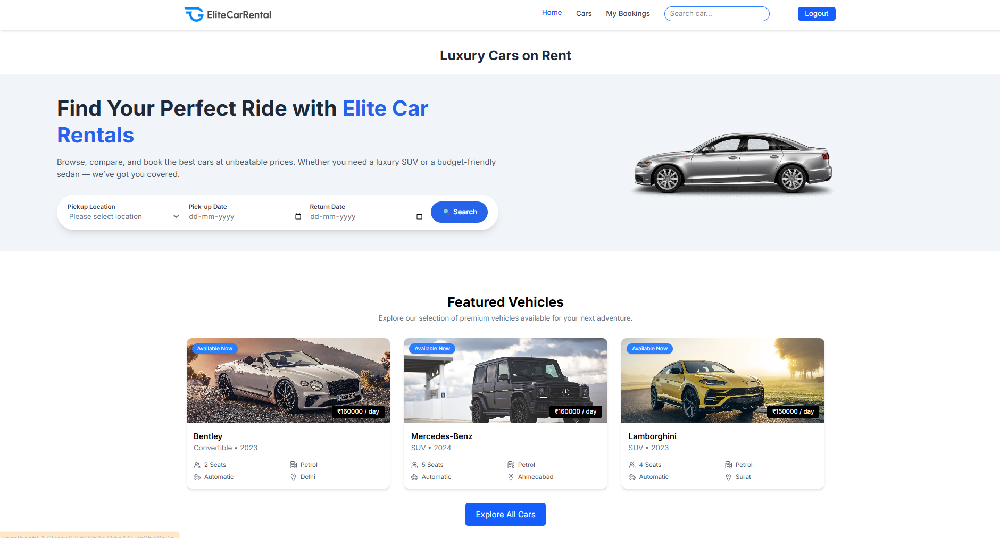
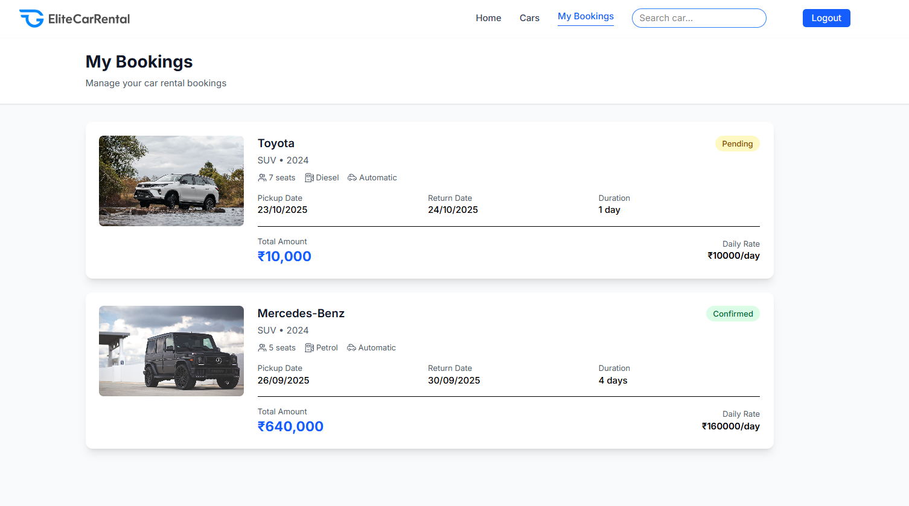
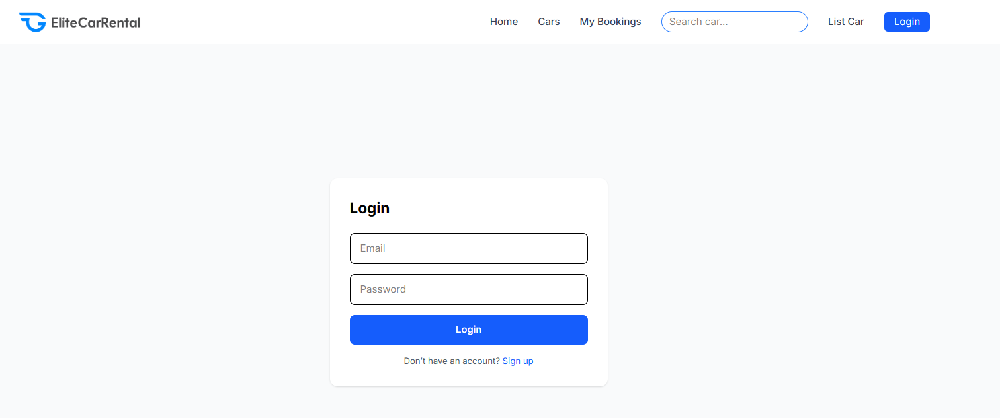
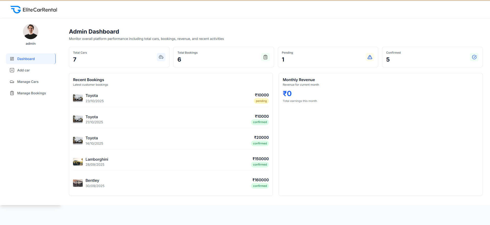

# 🚗 Elite Car Rental

A full-stack car rental platform built using the MERN Stack (MongoDB, Express.js, React.js, Node.js). The platform enables users to browse, book, and manage vehicle rentals while providing administrators with powerful management tools.

---

## 📌 Features

### 👤 User Features
- User Registration & Login
- Secure JWT Authentication
- Browse Available Vehicles
- Search & Filter Cars
- Book Cars Online
- View Booking History
- Profile Management

### 🛠️ Admin Features
- Manage Vehicles
- Manage Users
- Manage Bookings
- Dashboard Management
- Vehicle Availability Tracking

---

## 🏗️ Tech Stack

### Frontend
- React.js
- HTML5
- CSS3
- JavaScript
- Axios

### Backend
- Node.js
- Express.js

### Database
- MongoDB

### Authentication & Security
- JWT Authentication
- bcrypt Password Hashing

---

## 📂 Project Structure

```bash
EliteCarRental/
│
├── frontend/
│   ├── src/
│   ├── public/
│   └── package.json
│
├── backend/
│   ├── controllers/
│   ├── models/
│   ├── routes/
│   ├── middleware/
│   └── package.json
│
└── README.md
```

---

## 📸 Screenshots

### Home Page


### Availble Car


### My Booking


### Login Page


### Admin Dashboard


---

## ⚙️ Installation Guide

### 1️⃣ Clone Repository

```bash
git clone https://github.com/sonanihet2410/EliteCarRental.git
```

### 2️⃣ Navigate to Project

```bash
cd EliteCarRental
```

### 3️⃣ Install Backend Dependencies

```bash
cd backend
npm install
```

### 4️⃣ Install Frontend Dependencies

```bash
cd ../frontend
npm install
```

### 5️⃣ Configure Environment Variables

Create a `.env` file inside the backend folder:

```env
PORT=5000
MONGO_URI=your_mongodb_connection_string
JWT_SECRET=your_secret_key
```

### 6️⃣ Start Backend Server

```bash
cd backend
npm start
```

### 7️⃣ Start Frontend Application

```bash
cd frontend
npm start
```

---

## 🔐 Authentication

- JWT Based Authentication
- Protected Routes
- Secure Password Hashing using bcrypt
- Role-Based Access Control

---

## 🚀 Future Enhancements

- Online Payment Gateway Integration
- Email Notifications
- Vehicle Reviews & Ratings
- AI-Based Vehicle Recommendations
- Booking Analytics Dashboard
- Mobile Application Support

---

## 🎯 Learning Outcomes

Through this project I gained practical experience in:

- MERN Stack Development
- REST API Design
- Authentication & Authorization
- Database Management
- Frontend-Backend Integration
- Full Stack Application Deployment

---

## 👨‍💻 Author

**Het Sonani**

🎓 B.Tech Computer Engineering  
🏫 Dharmsinh Desai University

📧 sonanihet@gmail.com
🔗 LinkedIn: https://linkedin.com/in/het-sonani-b1ab3a2b0/

---
